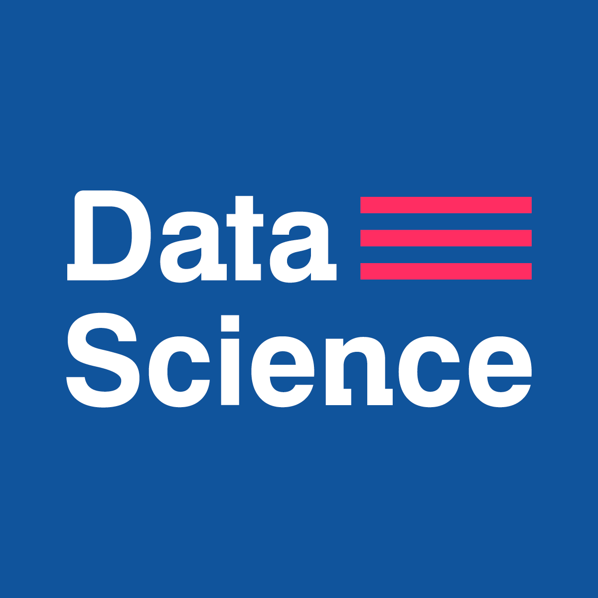

<h3 align="center">Open Source Road Map Data Science</h3>

  :bar_chart: ¡Camino a una educación autodidacta en <strong>Data Science</strong>!
    

## Contenido

- [Cómo contribuir](#Cómo-contribuir)
- [De qué trata esto](#De-qué-trata-esto)
- [Conviertete en un estudiante de Data Science Research Perú](#conviertete-en-un-estudiante-de-data-science-research-perú)
- [Motivación y Preparación](#Motivación-y-Preparación)
- [Currícula](#currícula)
- [Cómo usar está guía](#cómo-usar-está-guía)

## Cómo contribuir

Puede hacer un Pull Request y agregar más contenido. Aquí un [Tutorial](https://github.com/omegaup/omegaup/wiki/C%C3%B3mo-Hacer-un-Pull-Request)

## De qué trata esto

Esto es un camino sólido para aquellos que desean completar un curso de Ciencia de datos en su propio tiempo,
con cursos de las **mejores universidades** en el mundo. En nuestro plan de estudios, damos preferencia a los 
cursos de estilo MOOC (Massive Open Online Course) porque estos cursos se crearon teniendo en cuenta nuestro 
estilo de aprendizaje.
## Conviertete en un estudiante de Data Science Research Perú

Para inscribirse oficialmente en este curso, debe crear un perfil en nuestra [web](https://datascience.pe).

## Motivación y Preparación

Aquí hay dos enlaces interesantes que pueden marcar **toda** la diferencia en su viaje.

El primero es un video motivacional que muestra a un chico que pasó por el "Desafío MIT", 
que consiste en aprender todo el currículo MIT **de 4 años** para Ciencias de la Computación en **1 año**.

- [MIT Challenge](https://www.scotthyoung.com/blog/myprojects/mit-challenge-2/)

El segundo enlace es un MOOC que le enseñará técnicas de aprendizaje utilizadas por expertos en arte, música, 
literatura, matemáticas, ciencias, deportes y muchas otras disciplinas. Estas son **habilidades fundamentales**
para tener éxito.

- [Learning How to Learn](https://www.coursera.org/learn/learning-how-to-learn)

**¿Estas listo para empezar?**

## Currícula

- [Linear Algebra](#linear-algebra)
- [Single Variable Calculus](#single-variable-calculus)
- [Multivariable Calculus](#multivariable-calculus)
- [Python](#python)
- [Probability and Statistics](#probability-and-statistics)
- [Introduction to Data Science](#introduction-to-data-science)
- [Machine Learning](#machine-learning)
- [Convex Optimization](#convex-optimization)
- [Data Wrangling](#data-wrangling)
- [Big Data](#big-data)
- [Database](#database)
- [Deep Learning](#deep-learning)
- [Natural Language Processing](#natural-language-processing)
- [Specializations](#specializations)

---

### Algebra Lineal

Cursos | Duración | Esfuerzo | Plataforma
:-- | :--: | :--: | :--:
[Algebra Lineal - Fundamentos](https://www.edx.org/course/linear-algebra-foundations-frontiers-utaustinx-ut-5-04x#!)| 15 semanas | 8 horas/semana | Edx
[Aplicaciones de Álgebra Lineal Part 1](https://www.edx.org/course/applications-linear-algebra-part-1-davidsonx-d003x-1)| 5 semanas | 4 horas/semana | Edx
[Aplicaciones de Álgebra Lineal Part 2](https://www.edx.org/course/applications-linear-algebra-part-2-davidsonx-d003x-2)| 4 semanas | 5 horas/semana | Edx

### Cálculo
Cursos | Duración | Esfuerzo | Plataforma
:-- | :--: | :--: | :--:
[Calculus 1A: Diferenciación](https://www.edx.org/course/calculus-1a-differentiation-mitx-18-01-1x)| 13 semanas | 6-10 horas/semana | Edx
[Calculus 1B: Integración](https://www.edx.org/course/calculus-1b-integration-mitx-18-01-2x)| 13 semanas | 5-10 horas/semana | Edx
[Calculus 1C: Sistemas de coordenadas y series infinitas](https://www.edx.org/course/calculus-1c-coordinate-systems-infinite-mitx-18-01-3x)| 13 semanas | 6-10 horas/semana | Edx

### Cálculo multivariable
Cursos | Duración | Esfuerzo | Plataforma
:-- | :--: | :--: | :--:
[MIT Cálculo multivariable](http://ocw.mit.edu/courses/mathematics/18-02sc-multivariable-calculus-fall-2010/index.htm)| 15 semanas | 8 horas/semana | MIT

### Python
Cursos | Duración | Esfuerzo | Plataforma
:-- | :--: | :--: | :--:
[Introducción a Computer Science y Programación usando Python](https://www.edx.org/course/introduction-computer-science-mitx-6-00-1x-7)| 9 semanas | 15 horas/semana | Edx
[Introducción al Pensamiento Computacional y Ciencia de Datos](https://www.edx.org/course/introduction-computational-thinking-data-mitx-6-00-2x-3)| 10 semanas | 15 horas/semana | Edx
[Introducción a Python para Ciencia](https://prod-edx-mktg-edit.edx.org/course/introduction-python-data-science-microsoft-dat208x-1)| 6 semanas | 2-4 horas/semana | Edx
[Programación con Python para Ciencia de Datos](https://www.edx.org/course/programming-python-data-science-microsoft-dat210x)| 6 semanas | 3-4 horas/semana | Edx

### Probabilidad y Estadística
Cursos | Duración | Esfuerzo | Plataforma
:-- | :--: | :--: | :--:
[Introducción a la Probabilidad](https://www.edx.org/course/introduction-probability-science-mitx-6-041x-1#.U3yb762SzIo)| 16 semanas | 12 horas/semana | Edx
[Razonamiento Estadístico](https://lagunita.stanford.edu/courses/OLI/StatReasoning/Open/about)| - semanas | - horas/semana | Standford
[Introducción a la Estadística: Descriptiva](https://www.edx.org/course/introduction-statistics-descriptive-uc-berkeleyx-stat2-1x)| 5 semanas | - horas/semana | Edx
[Introducción a la Estadística: Probabilística](https://www.edx.org/course/introduction-statistics-probability-uc-berkeleyx-stat2-2x)| 5 semanas | - horas/semana | Edx
[Introducción a la Estadística: Inferencia](https://www.edx.org/course/introduction-statistics-inference-uc-berkeleyx-stat2-3x)| 5 semanas | - horas/semana | Edx

### Introducción a la Ciencia de Datos
Cursos | Duración | Esfuerzo | Plataforma
:-- | :--: | :--: | :--:
[Introducción a la Ciencia de Datos](https://www.coursera.org/course/datasci)| 8 semanas | 10-12 horas/semana | Coursera
[Ciencia de Datos - CS109 de Harvard](http://cs109.github.io/2015/)| 12 semanas | 5-6 horas/semana | Harvard
[La Ventaja de Analítica](https://www.edx.org/course/analytics-edge-mitx-15-071x-2)| 12 semanas | 10-15 horas/semana | Edx

### Machine Learning
Cursos | Duración | Esfuerzo | Plataforma
:-- | :--: | :--: | :--:
[Introducción a Machine Learning](https://www.edx.org/course/learning-data-introductory-machine-caltechx-cs1156x) | 10 semanas | 10-20 horas/semana | Edx
[Aprendiendo de los Datos](http://work.caltech.edu/lectures.html) | 10 semanas | 10-20 horas/semana | California Institute of Technology
[Aprendizaje estadístico](https://lagunita.stanford.edu/courses/HumanitiesSciences/StatLearning/Winter2016/about)| - semanas | 3 horas/semana | Standford
[Curso Machine Learning de Stanford](https://www.coursera.org/learn/machine-learning)| - semanas | 8-12 horas/semana | Coursera

### Optimización Convexa
Cursos | Duración | Esfuerzo | Plataforma
:-- | :--: | :--: | :--:
[Optimización Convexa](https://lagunita.stanford.edu/courses/Engineering/CVX101/Winter2014/about)| 9 semanas | 10 horas/semana | Standford

### Manipulación y recuperación de datos
Cursos | Duración | Esfuerzo | Plataforma
:-- | :--: | :--: | :--:
[Manipulación y recuperación de datos con MongoDB](https://www.udacity.com/course/data-wrangling-with-mongodb--ud032)| 8 semanas | 10 horas/semana | Udacity

### Big Data
Cursos | Duración | Esfuerzo | Plataforma
:-- | :--: | :--: | :--:
[Introducción a Hadoop y MapReduce](https://www.udacity.com/course/intro-to-hadoop-and-mapreduce--ud617)| 4 semanas | 6 horas/semana | Udacity
[Despliegue a Hadoop Cluster](https://www.udacity.com/course/deploying-a-hadoop-cluster--ud1000)| 3 semanas | 6 horas/semana | Udacity

### Base de Datos
Cursos | Duración | Esfuerzo | Plataforma
:-- | :--: | :--: | :--:
[Curso Base de Datos de Stanford](https://lagunita.stanford.edu/courses/DB/2014/SelfPaced/about)| - semanas | 8-12 horas/semana | Stanford

### Natural Language Processing
Cursos | Duración | Esfuerzo | Plataforma
:-- | :--: | :--: | :--:
[Deep Learning for Natural Language Processing](http://cs224d.stanford.edu/)| - semanas | - horas/semana | Stanford

### Deep Learning
Cursos | Duración | Esfuerzo | Plataforma
:-- | :--: | :--: | :--:
[Deep Learning](https://www.udacity.com/course/deep-learning--ud730)| 12 semanas | 8-12 horas/semana | Udacity

### Especialización

Después de terminar los cursos anteriores, comience sus especializaciones en los temas que le interesan más.
Puede ver una lista de especializaciones disponibles. [Aquí](https://github.com/DataScienceResearchPeru/OpenSource-RoadMap-DataScience/tree/master/especializacion).

## Cómo usar está guía

### Orden de las clases

Esta guía fue desarrollada para ser consumida en un enfoque lineal. ¿Qué significa esto? Que debes completar un curso a la vez.

Los cursos ya están en el orden en que debe completarse.
Simplemente comience en la sección [Álgebra lineal] (#álgebra-lineal) y después de terminar el primer curso, comience el siguiente.

**Si el curso no está abierto, hágalo de todos modos con los recursos de la clase anterior.**

### ¿Debo tomar todos los cursos?

**Si!** ¡La intención es concluir **todos** los cursos listados aquí!

### Duración

¡Puede llevar más tiempo completar todas las clases en comparación con un curso regular de Ciencias de Datos, pero podemos **garantizar** que su **recompensa** será proporcional a **su motivación / dedicación**!

Debes concentrarte en tu **hábito** y **olvidarte** de los objetivos. Intenta invertir 1 ~ 2 horas **todos los días** estudiando este plan de estudios. Si haces esto, **inevitablemente** terminarás este plan de estudios.

## Probabilidad y Estadística

## Text Mining
