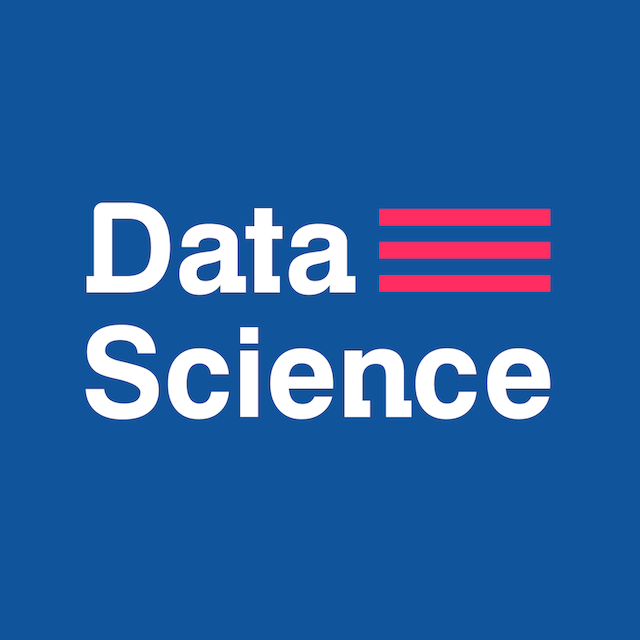

<h3 align="center">Open Source Road Map Data Science 2021</h3>

  ¡Camino a una educación autodidacta en <strong>Data Science</strong>!
    

## --Contenido

- [De qué trata esto](#De-qué-trata-esto)
- [Conviértete en un estudiante de Data Science Research Perú](#conviertete-en-un-estudiante-de-data-science-research-perú)
- [Motivación y Preparación](#Motivación-y-Preparación)
- [Currícula](#currícula)
- [Cómo usar está guía](#cómo-usar-está-guía)
- [Cómo contribuir](#Cómo-contribuir)

## --De qué trata esto

Esto es un camino sólido para aquellos que desean completar un curso de Ciencia de datos en su propio tiempo, con cursos de las **mejores universidades** en el mundo. En nuestro plan de estudios, damos preferencia a los cursos de estilo MOOC (Massive Open Online Course) porque estos cursos se crearon teniendo en cuenta nuestro  estilo de aprendizaje.

## --Conviertete en un estudiante de Data Science Research Perú

Pueden enviarnos sugerencias y unirse a nuestros grupos de WhatsApp mediante el siguiente los siguientes enlaces:
  - [Telegram](https://t.me/DataScienceResearchPeru) - Recomendado
  - [Whatsapp](https://chat.whatsapp.com/EQbIelJffs73ftKSvbvnDZ)  
  - [Discord](https://discord.gg/nEEfhfJ77b)

**[Recomendado]** Si deseas contactarte con nuestro responsable, puedes escribirle al [Whatsapp](https://wa.me/51931534817).

## --Motivación y Preparación

Aquí hay dos enlaces interesantes que pueden marcar **toda** la diferencia en su viaje.

1. El primero es un video motivacional que muestra a un chico que pasó por el "Desafío MIT",
que consiste en aprender todo el currículo MIT **de 4 años** para Ciencias de la Computación en **1 año**.

   - [MIT Challenge](https://www.scotthyoung.com/blog/myprojects/mit-challenge-2/)

2. El segundo enlace es un MOOC que le enseñará técnicas de aprendizaje utilizadas por expertos en arte, música,
literatura, matemáticas, ciencias, deportes y muchas otras disciplinas. Estas son **habilidades fundamentales**
para tener éxito.

     - Curso Aprendiendo a aprender: [English]((https://www.coursera.org/learn/learning-how-to-learn)), [Spanish](https://www.coursera.org/learn/aprendiendo-a-aprender)

3. El tercer enlace es un vídeo sobre `100` motivos para estudiar Informática. Repasa las **razones fascinantes para aprender** Ciencias de la Computación y toda lo emocionante que implica más allá de una demanda laboral en crecimiento.

   - [100 MOTIVOS para estudiar INFORMÁTICA](https://www.youtube.com/watch?v=CTazANzywSA)

**¿Estás listo para empezar?**

## --Currícula

- [--Contenido](#--contenido)
- [--De qué trata esto](#--de-qué-trata-esto)
- [--Conviertete en un estudiante de Data Science Research Perú](#--conviertete-en-un-estudiante-de-data-science-research-perú)
- [--Motivación y Preparación](#--motivación-y-preparación)
- [--Cursos de Computer Science con videos](#--computer-science-courses-with-video)
- [--Currícula](#--currícula)
  - [--Algebra Lineal](#--algebra-lineal)
  - [--Cálculo](#--cálculo)
  - [--Cálculo multivariable](#--cálculo-multivariable)
  - [--Base de Datos](#--base-de-datos)
  - [--Probabilidad y Estadística](#--probabilidad-y-estadística)
  - [--Python](#--python)
  - [--R](#--r)
  - [--Introducción a la Ciencia de Datos (Data Science)](#--introducción-a-la-ciencia-de-datos-data-science)
  - [--Introducción a la Ciencia de la Computación (Computer Science)](#--introducción-a-la-ciencia-de-la-computación-computer-science)
  - [--Aprendizaje de Máquina y Minería de Datos (Machine Learning & Data Mining)](#--aprendizaje-de-máquina-y-minería-de-datos-machine-learning--data-mining)
  - [--Manipulación y recuperación de datos](#--manipulación-y-recuperación-de-datos)
  - [--Data Science Tools & Methods](#--data-science-tools--methods)
  - [--Especialización](#--especialización)
- [--Cómo usar está guía](#--cómo-usar-está-guía)
  - [Orden de las clases](#orden-de-las-clases)
  - [¿Debo tomar todos los cursos?](#debo-tomar-todos-los-cursos)
  - [Duración](#duración)
- [--Cómo contribuir](#--cómo-contribuir)
- [Créditos](#créditos)

---
### --Cursos de Computer Science con videos
Usamos una copia de este [Repo](https://github.com/Developer-Y/cs-video-courses) en el cual puedes encontrar muchos videos relacionados a Inteligencia Artificial, base de datos, machine learning, matemáticas y más. Si te animas puedes dejar tu Pull Request en este link [Aquí](https://github.com/DataScienceResearchPeru/OpenSource-RoadMap-DataScience/tree/master/computer-science-video).

---

### --Algebra Lineal

| Cursos                                                                                                                   |  Duración  |    Esfuerzo    | Plataforma |
| :----------------------------------------------------------------------------------------------------------------------- | :--------: | :------------: | :--------: |
| [Esencia del Algebra Lineal](https://www.youtube.com/playlist?list=PLIb_io8a5NB2DddFf-PwvZDCOUNT1GZoA)                   |  1 semana  | 4 horas/semana |  YouTube   |
| [Algebra Lineal - Fundamentos](https://www.edx.org/course/linear-algebra-foundations-to-frontiers)                       | 15 semanas | 8 horas/semana |    Edx     |
| [Algebra Lineal - Avanzado](https://www.edx.org/course/advanced-linear-algebra-foundations-to-frontiers)                 | 15 semanas | 8 horas/semana |    Edx     |
| [Aplicaciones de Álgebra Lineal Part 1](https://www.edx.org/course/applications-linear-algebra-part-1-davidsonx-d003x-1) | 5 semanas  | 4 horas/semana |    Edx     |
| [Aplicaciones de Álgebra Lineal Part 2](https://www.edx.org/course/applications-linear-algebra-part-2-davidsonx-d003x-2) | 4 semanas  | 5 horas/semana |    Edx     |

### --Cálculo
| Cursos                                                                                                                                      |  Duración  |     Esfuerzo      | Plataforma |
| :------------------------------------------------------------------------------------------------------------------------------------------ | :--------: | :---------------: | :--------: |
| [Calculus 1A: Diferenciación](https://www.edx.org/course/calculus-1a-differentiation-mitx-18-01-1x)                                         | 13 semanas | 6-10 horas/semana |    Edx     |
| [Calculus 1B: Integración](https://www.edx.org/course/calculus-1b-integration-mitx-18-01-2x)                                                | 13 semanas | 5-10 horas/semana |    Edx     |
| [Calculus 1C: Sistemas de coordenadas y series infinitas](https://www.edx.org/course/calculus-1c-coordinate-systems-infinite-mitx-18-01-3x) | 13 semanas | 6-10 horas/semana |    Edx     |

### --Cálculo multivariable
| Cursos                                                                                                                 |  Duración  |    Esfuerzo    | Plataforma |
| :--------------------------------------------------------------------------------------------------------------------- | :--------: | :------------: | :--------: |
| [MIT Cálculo multivariable](http://ocw.mit.edu/courses/mathematics/18-02sc-multivariable-calculus-fall-2010/index.htm) | 15 semanas | 8 horas/semana |    MIT     |

### --Base de Datos
| Cursos                                                                                                                                  | Duración  |     Esfuerzo      | Plataforma |
| :-------------------------------------------------------------------------------------------------------------------------------------- | :-------: | :---------------: | :--------: |
| [Database Management Essentials](https://www.coursera.org/learn/database-management)                                                    | 4 semanas | 8-10 horas/semana |  Cousera   |
| [Data Warehouse Concepts, Design, and Data Integration](https://www.coursera.org/learn/dwdesign)                                        | 3 semanas | 8-10 horas/semana |  Cousera   |
| [Relational Database Support for Data Warehouses](https://www.coursera.org/learn/dwrelational)                                          | 3 semanas | 8-10 horas/semana |  Cousera   |
| [Business Intelligence Concepts, Tools, and Applications](https://www.coursera.org/learn/business-intelligence-tools)                   | 3 semanas | 8-10 horas/semana |  Cousera   |
| [Design and Build a Data Warehouse for Business Intelligence Implementation](https://www.coursera.org/learn/data-warehouse-bi-building) | 3 semanas | 8-10 horas/semana |  Cousera   |
| [MongoDB for Developers Learning Path](https://university.mongodb.com/learning_paths/developer)                                         | - semanas |  - horas/semana   |  MongoDB   |

<!--
OUTDATED
[Base de Datos Relacionales y SQL](https://www.edx.org/es/course/databases-5-sql)| 2 semanas | 8-10 horas/semana | Stanford
[Base de Datos Relacionales y SQL (Avanzado)](https://www.edx.org/es/course/advanced-topics-in-sql)| 2 semanas | 8-10 horas/semana | Stanford
[Curso Base de Datos Json](https://www.edx.org/es/course/databases-3-json-data)| - semanas | 8-12 horas/semana | Stanford
-->

### --Probabilidad y Estadística
| Cursos                                                                                                             | Duración |    Esfuerzo    | Plataforma |
| :----------------------------------------------------------------------------------------------------------------- | :------: | :------------: | :--------: |
| [Introducción a la Probabilidad](https://projects.iq.harvard.edu/stat110/home)                                     | 19 horas | - horas/semana |  Harvard   |
| [Introducción a la Estadística Descriptiva](https://www.udacity.com/course/intro-to-descriptive-statistics--ud827) | 19 horas | - horas/semana |  Udacity   |
| [Introducción a la Estadística Inferencial](https://www.udacity.com/course/intro-to-inferential-statistics--ud201) | 19 horas | - horas/semana |  Udacity   |
| [Conceptos básicos con Python](https://www.datacamp.com/tracks/statistics-fundamentals-with-python)                | 19 horas | - horas/semana |  DataCamp  |

<!--
OUTDATED
[Razonamiento Estadístico](https://lagunita.stanford.edu/courses/OLI/StatReasoning/Open/about)| - semanas | - horas/semana | Standford
[Introducción a la Estadística: Descriptiva](https://www.edx.org/course/introduction-statistics-descriptive-uc-berkeleyx-stat2-1x)| 5 semanas | - horas/semana | Edx
[Introducción a la Estadística: Probabilística](https://www.edx.org/course/introduction-statistics-probability-uc-berkeleyx-stat2-2x)| 5 semanas | - horas/semana | Edx
[Introducción a la Estadística: Inferencia](https://www.edx.org/course/introduction-statistics-inference-uc-berkeleyx-stat2-3x)| 5 semanas | - horas/semana | Edx
-->

### --Python
| Cursos                                                                                                                                             |  Duración  |    Esfuerzo     | Plataforma |
| :------------------------------------------------------------------------------------------------------------------------------------------------- | :--------: | :-------------: | :--------: |
| [Introducción a Computer Science y Programación usando Python](https://www.edx.org/course/introduction-computer-science-mitx-6-00-1x-7)            | 9 semanas  | 15 horas/semana |    Edx     |
| [Introducción al Pensamiento Computacional y Ciencia de Datos](https://www.edx.org/course/introduction-computational-thinking-data-mitx-6-00-2x-3) | 10 semanas | 15 horas/semana |    Edx     |

<!--
OUTDATED
[Introducción a Python para Ciencia](https://prod-edx-mktg-edit.edx.org/course/introduction-python-data-science-microsoft-dat208x-1)| 6 semanas | 2-4 horas/semana | Edx
[Programación con Python para Ciencia de Datos](https://www.edx.org/course/programming-python-data-science-microsoft-dat210x)| 6 semanas | 3-4 horas/semana | Edx
-->

### --R
| Cursos                                                                                                                                      | Duración  |     Esfuerzo     | Plataforma |
| :------------------------------------------------------------------------------------------------------------------------------------------ | :-------: | :--------------: | :--------: |
| [Programa especializado Data Science: Foundations using R](https://www.coursera.org/specializations/data-science-foundations-r)             |  4 meses  |  6 horas/semana  |  Coursera  |
| [Programación R](https://www.coursera.org/learn/r-programming)                                                                              | 2 semanas | 10 horas/semana  |  Coursera  |
| [Programa especializado Statistics with R](https://www.coursera.org/specializations/statistics)                                             |  7 meses  |  5 horas/semana  |  Coursera  |
| [Introducción a Data Science: Programación Estadística con R](https://www.coursera.org/learn/intro-data-science-programacion-estadistica-r) | 4 semanas | 3-5 horas/semana |  Coursera  |

### --Introducción a la Ciencia de Datos (Data Science)
| Cursos                                                                                        | Duración  |      Esfuerzo      | Plataforma |
| :-------------------------------------------------------------------------------------------- | :-------: | :----------------: | :--------: |
| [¿Qué es Ciencia de Datos (DataScience)?](https://www.coursera.org/learn/what-is-datascience) | 1 semanas | 8-10 horas/semana  |  Coursera  |
| [Introducción a la Ciencia de Datos](https://www.coursera.org/course/datasci)                 | 8 semanas | 10-12 horas/semana |  Coursera  |

### --Introducción a la Ciencia de la Computación (Computer Science)
_Estudiantes que saben programar en Python o R pueden omitir este inciso._

| Cursos                                                                                                                                        | Duración  |      Esfuerzo      | Plataforma |
| :-------------------------------------------------------------------------------------------------------------------------------------------- | :-------: | :----------------: | :--------: |
| [Introduction to Computer Science and Programming Using Python](https://www.edx.org/course/introduction-computer-science-mitx-6-00-1x-7)      | 9 semanas | 14-16 horas/semana |    EdX     |
| [Introduction to Computational Thinking and Data Science](https://www.edx.org/course/introduction-computational-thinking-data-mitx-6-00-2x-3) | 9 semanas | 14-16 horas/semana |    EdX     |

<!--
OUTDATED
[Ciencia de Datos - CS109 de Harvard](http://cs109.github.io/2015/)| 12 semanas | 5-6 horas/semana | Harvard
[La Ventaja de Analítica](https://www.edx.org/course/analytics-edge-mitx-15-071x-2)| 12 semanas | 10-15 horas/semana | Edx
-->

### --Aprendizaje de Máquina y Minería de Datos (Machine Learning & Data Mining)
| Cursos                                                                                       |  Duración  |     Esfuerzo      | Plataforma |
| :------------------------------------------------------------------------------------------- | :--------: | :---------------: | :--------: |
| [Machine Learning](https://www.coursera.org/learn/machine-learning)                          | 6 semanas  | 8-10 horas/semana |  Coursera  |
| [Intro to Machine Learning](https://www.udacity.com/course/intro-to-machine-learning--ud120) | 10 semanas | 8-10 horas/semana |  Udacity   |
| [Mining Massive Datasets](https://www.edx.org/course/mining-massive-datasets)                | 7 semanas  | 5-10 horas/semana |    Edx     |
| [Process Mining](https://www.coursera.org/learn/process-mining)                              | 3 semanas  | 5-10 horas/semana |  Coursera  |

<!--
OUTDATED
[Introducción a Machine Learning](https://www.edx.org/course/learning-data-introductory-machine-caltechx-cs1156x) | 10 semanas | 10-20 horas/semana | Edx
[Aprendiendo de los Datos](http://work.caltech.edu/lectures.html) | 10 semanas | 10-20 horas/semana | California Institute of Technology
[Aprendizaje estadístico](https://lagunita.stanford.edu/courses/HumanitiesSciences/StatLearning/Winter2016/about)| - semanas | 3 horas/semana | Stanford
[Curso Machine Learning de Stanford](https://www.coursera.org/learn/machine-learning)| - semanas | 8-12 horas/semana | Coursera

OUTDATED
### --Optimización Convexa
| Cursos                                                                                            | Duración  |    Esfuerzo     | Plataforma |
| :------------------------------------------------------------------------------------------------ | :-------: | :-------------: | :--------: |
| [Optimización Convexa](https://lagunita.stanford.edu/courses/Engineering/CVX101/Winter2014/about) | 9 semanas | 10 horas/semana |  Stanford  |
-->

### --Manipulación y recuperación de datos
| Cursos                                                                                                                | Duración  |    Esfuerzo     | Plataforma |
| :-------------------------------------------------------------------------------------------------------------------- | :-------: | :-------------: | :--------: |
| [Manipulación y recuperación de datos con MongoDB](https://www.udacity.com/course/data-wrangling-with-mongodb--ud032) | 8 semanas | 10 horas/semana |  Udacity   |

### --Data Science Tools & Methods
| Cursos                                                                                      | Duración  |    Esfuerzo    | Plataforma |
| :------------------------------------------------------------------------------------------ | :-------: | :------------: | :--------: |
| [Tools for Data Science](https://www.coursera.org/learn/open-source-tools-for-data-science) | - semanas | - horas/semana |  Coursera  |
| [Data Science Methodology](https://www.coursera.org/learn/data-science-methodology)         | - semanas | - horas/semana |  Coursera  |
| [Data Science: Wrangling](https://www.edx.org/course/data-science-wrangling)                | - semanas | - horas/semana |    EdX     |

---

### --Especialización

¿Big Data?¿Deep Learning?¿NLP?¿Computer Vision?

Después de terminar los cursos anteriores, comience sus especializaciones en los temas que le interesan más.
Puede ver una lista de especializaciones disponibles. [Aquí](https://github.com/DataScienceResearchPeru/OpenSource-RoadMap-DataScience/tree/master/especializacion).

---

## --Cómo usar está guía

### Orden de las clases

Esta guía fue desarrollada para ser consumida en un enfoque lineal. ¿Qué significa esto? Que debes completar un curso a la vez.

Los cursos ya están en el orden en que debe completarse.
Simplemente comience en la sección [Álgebra lineal](#álgebra-lineal) y después de terminar el primer curso, comience el siguiente.

**Si el curso no está abierto, hágalo de todos modos con los recursos de la clase anterior.**

### ¿Debo tomar todos los cursos?

**Si!** ¡La intención es concluir **todos** los cursos listados aquí!

### Duración

¡Puede llevar más tiempo completar todas las clases en comparación con un curso regular de Ciencias de Datos, pero podemos **garantizar** que su **recompensa** será proporcional a **su motivación / dedicación**!

Debes concentrarte en tu **hábito** y **olvidarte** de los objetivos. Intenta invertir 1 ~ 2 horas **todos los días** estudiando este plan de estudios. Si haces esto, **inevitablemente** terminarás este plan de estudios.

## --Cómo contribuir

El objetivo de este repositorio es contribuir a la formación de los profesionales interesados en Ciencia de Datos e Inteligencia Artificial.
Esto ayudará a incrementar los profesionales peruanos e hispanohablantes y así tener más Data Scientist, Data Engineer, Machine Learning Engineer, Data Architects y demás perfiles existentes.
Puede hacer un Pull Request y agregar más contenido que crea necesario.
Aquí un [Tutorial](https://blog.desdelinux.net/tutorial-simple-primer-pr-pull-request/)

## Créditos
El repositorio que nos sirvió de inspiración: [OSSU](https://github.com/ossu/data-science)
