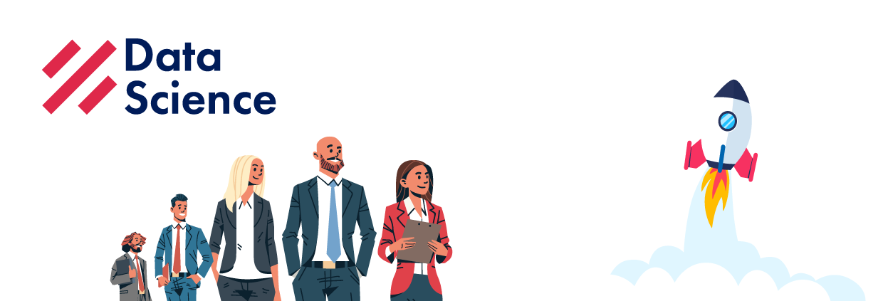

  

<h3 align="center">Open Source Road Map Data Science 2022</h3>

  ¡Camino a una educación autodidacta en <strong>Data Science</strong>!
    

## --Contenido

- [De qué trata esto](#--De-qu%C3%A9-trata-esto)
- [Conviértete en un estudiante de Data Science Research Perú](#--Convi%C3%A9rtete-en-un-estudiante-de-Data-Science-Research-Per%C3%BA)
- [Motivación y Preparación](#--Motivaci%C3%B3n-y-Preparaci%C3%B3n)
- [Currícula](#--Curr%C3%ADcula)
- [Cómo usar esta guía](#--C%C3%B3mo-usar-esta-gu%C3%ADa)
- [Cómo contribuir](#--C%C3%B3mo-contribuir)

## --De qué trata esto

Esto es un camino sólido para aquellos que desean completar un curso de Ciencia de datos en su propio tiempo, con cursos de las **mejores universidades** en el mundo. En nuestro plan de estudios, damos preferencia a los cursos de estilo MOOC (Massive Open Online Course) porque estos cursos se crearon teniendo en cuenta nuestro estilo de aprendizaje.

## --Conviértete en un estudiante de Data Science Research Perú

Pueden enviarnos sugerencias y unirse a nuestros grupos de WhatsApp mediante los siguientes enlaces:
  - [Telegram](https://t.me/DataScienceResearchPeru) - Deshabilitado por ahora
  - [Whatsapp](https://chat.whatsapp.com/EQbIelJffs73ftKSvbvnDZ)  
  - [Discord](https://discord.gg/nEEfhfJ77b)

**[Recomendado]** Si deseas contactarte con nuestro responsable, puedes escribirle al [Whatsapp](https://wa.me/51931534817).

## --Motivación y Preparación

Aquí hay dos enlaces interesantes que pueden marcar **toda** la diferencia en su viaje.

1. El primero es un video motivacional que muestra a un chico que pasó por el "Desafío MIT", que consiste en aprender todo el currículo MIT **de 4 años** para Ciencias de la Computación en **1 año**.

   - [MIT Challenge](https://www.scotthyoung.com/blog/myprojects/mit-challenge-2/)

2. El segundo enlace es un MOOC que le enseñará técnicas de aprendizaje utilizadas por expertos en arte, música, literatura, matemáticas, ciencias, deportes y muchas otras disciplinas. Estas son **habilidades fundamentales** para tener éxito.

   - Curso Aprendiendo a aprender: [English](https://www.coursera.org/learn/learning-how-to-learn), [Spanish](https://www.coursera.org/learn/aprendiendo-a-aprender)

3. El tercer enlace es un vídeo sobre `100` motivos para estudiar Informática. Repasa las **razones fascinantes para aprender** Ciencias de la Computación y toda lo emocionante que implica más allá de una demanda laboral en crecimiento.

   - [100 MOTIVOS para estudiar INFORMÁTICA](https://www.youtube.com/watch?v=CTazANzywSA)

**¿Estás listo para empezar?**

## --Currícula

- [--Contenido](#--Contenido)
- [--De qué trata esto](#--De-qu%C3%A9-trata-esto)
- [--Conviértete en un estudiante de Data Science Research Perú](#--Convi%C3%A9rtete-en-un-estudiante-de-Data-Science-Research-Per%C3%BA)
- [--Motivación y Preparación](#--Motivaci%C3%B3n-y-Preparaci%C3%B3n)
- [--Currícula](#--Curr%C3%ADcula)
  - [--Cursos de Computer Science con videos](#--Cursos-de-Computer-Science-con-videos)
  - [--Álgebra Lineal](#--Álgebra-Lineal)
  - [--Cálculo de una variable](#--Cálculo-de-una-variable)
  - [--Cálculo multivariable](#--Cálculo-multivariable)
  - [--Base de Datos](#--Base-de-Datos)
  - [--Probabilidad y Estadística](#--Probabilidad-y-Estadística)
  - [--Python](#--Python)
  - [--Introducción a la Ciencia de Datos (Data Science)](#--Introducción-a-la-Ciencia-de-Datos-Data-Science)
  - [--Introducción a la Ciencia de la Computación (Computer Science)](#--Introducción-a-la-Ciencia-de-la-Computación-Computer-Science)
  - [--Aprendizaje de Máquina y Minería de Datos (Machine Learning & Data Mining)](#--Aprendizaje-de-Máquina-y-Minería-de-Datos-Machine-Learning--Data-Mining)
  - [--Manipulación y recuperación de datos](#--Manipulación-y-recuperación-de-datos)
  - [--Data Science Tools & Methods](#--Data-Science-Tools--Methods)
  - [--Especialización](#--Especialización)
- [--Cómo usar esta guía](#--Cómo-usar-esta-gu%C3%ADa)
  - [Orden de las clases](#Orden-de-las-clases)
  - [¿Debo tomar todos los cursos?](#Debo-tomar-todos-los-cursos)
  - [Duración](#Duración)
- [--Cómo contribuir](#--Cómo-contribuir)
- [Créditos](#Créditos)

---
### --Cursos de Computer Science con videos
Usamos una copia de este [Repo](https://github.com/Developer-Y/cs-video-courses) en el cual puedes encontrar muchos videos relacionados a Inteligencia Artificial, base de datos, machine learning, matemáticas y más. Si te animas puedes dejar tu Pull Request en este link [Aquí](https://github.com/DataScienceResearchPeru/OpenSource-RoadMap-DataScience/tree/master/computer-science-video).

---

### --Álgebra Lineal

| Cursos                                                                                                   | Duración  |    Esfuerzo    | Plataforma |
| :------------------------------------------------------------------------------------------------------- | :-------: | :------------: | :--------: |
| [Esencia del Álgebra Lineal](https://www.youtube.com/playlist?list=PLIb_io8a5NB2DddFf-PwvZDCOUNT1GZoA)   |  1 semana | 4 horas/semana |   YouTube  |
| [Khan Academy: Álgebra Lineal](https://es.khanacademy.org/math/linear-algebra)                           | - semana | - horas/semana | Khan Academy |
| [Álgebra Lineal - Fundamentos](https://www.edx.org/course/linear-algebra-foundations-to-frontiers)       | 15 semanas | 8 horas/semana |    Edx     |
| [Álgebra Lineal - Avanzado](https://www.edx.org/course/advanced-linear-algebra-foundations-to-frontiers) | 15 semanas | 8 horas/semana |    Edx     |
| [Álgebra 2021 MIT](https://ocw.mit.edu/courses/18-06sc-linear-algebra-fall-2011/)                        | 12 semanas | 4 horas/semana | MITOpenCourse |

### --Cálculo de una variable
| Cursos                                                                                                                                      | Duración |    Esfuerzo    | Plataforma |
| :------------------------------------------------------------------------------------------------------------------------------------------ | :------: | :------------: | :--------: |
| [Khan Academy: Precálculo](https://es.khanacademy.org/math/precalculus)                                                                     | - semanas | - horas/semana | Khan Academy |
| [Cálculo 1A: Diferenciación](https://www.edx.org/course/calculus-1a-differentiation-mitx-18-01-1x)                                         | 13 semanas | 6-10 horas/semana |    Edx     |
| [Cálculo 1B: Integración](https://www.edx.org/course/calculus-1b-integration-mitx-18-01-2x)                                                | 13 semanas | 5-10 horas/semana |    Edx     |
| [Cálculo 1C: Sistemas de coordenadas y series infinitas](https://www.edx.org/course/calculus-1c-coordinate-systems-infinite-mitx-18-01-3x) | 13 semanas | 6-10 horas/semana |    Edx     |

### --Cálculo multivariable
| Cursos                                                                                                                 | Duración |    Esfuerzo    | Plataforma |
| :--------------------------------------------------------------------------------------------------------------------- | :-------: | :------------: | :--------: |
| [Khan Academy: Cálculo multivariable](https://es.khanacademy.org/math/multivariable-calculus)                          | - semanas | - horas/semana | Khan Academy |
| [MIT Cálculo multivariable](http://ocw.mit.edu/courses/mathematics/18-02sc-multivariable-calculus-fall-2010/index.htm) | 15 semanas | 8 horas/semana |    MIT     |

### --Base de Datos
| Cursos                                                                                                                                  | Duración |     Esfuerzo      | Plataforma |
| :-------------------------------------------------------------------------------------------------------------------------------------- | :------: | :---------------: | :--------: |
| [Database Management Essentials](https://www.coursera.org/learn/database-management)                                                    | 4 semanas | 8-10 horas/semana |  Coursera  |
| [Data Warehouse Concepts, Design, and Data Integration](https://www.coursera.org/learn/dwdesign)                                        | 3 semanas | 8-10 horas/semana |  Coursera  |
| [Relational Database Support for Data Warehouses](https://www.coursera.org/learn/dwrelational)                                          | 3 semanas | 8-10 horas/semana |  Coursera  |
| [Business Intelligence Concepts, Tools, and Applications](https://www.coursera.org/learn/business-intelligence-tools)                   | 3 semanas | 8-10 horas/semana |  Coursera  |
| [Design and Build a Data Warehouse for Business Intelligence Implementation](https://www.coursera.org/learn/data-warehouse-bi-building) | 3 semanas | 8-10 horas/semana |  Coursera  |
| [MongoDB for Developers Learning Path](https://university.mongodb.com/learning_paths/developer)                                         | - semanas | - horas/semana   |  MongoDB   |

### --Probabilidad y Estadística
| Cursos                                                                                                             | Duración |    Esfuerzo    | Plataforma |
| :----------------------------------------------------------------------------------------------------------------- | :------: | :------------: | :--------: |
| [Introducción a la Probabilidad](https://projects.iq.harvard.edu/stat110/home)                                     | 19 horas | - horas/semana |  Harvard   |
| [Introducción a la Estadística Descriptiva](https://www.udacity.com/course/intro-to-descriptive-statistics--ud827) | 19 horas | - horas/semana |  Udacity   |
| [Introducción a la Estadística Inferencial](https://www.udacity.com/course/intro-to-inferential-statistics--ud201) | 19 horas | - horas/semana |  Udacity   |
| [Conceptos básicos con Python](https://www.datacamp.com/tracks/statistics-fundamentals-with-python)                | 19 horas | - horas/semana |  DataCamp  |

### --Python
| Cursos                                                                                                                                             | Duración |    Esfuerzo     | Plataforma |
| :------------------------------------------------------------------------------------------------------------------------------------------------- | :------: | :-------------: | :--------: |
| [Python para todos](https://www.py4e.com/)                                                                                                         | 8 semanas | 8 horas/semana  |    py4e    |
| [Introducción a Computer Science y Programación usando Python](https://www.edx.org/course/introduction-computer-science-mitx-6-00-1x-7)            | 9 semanas | 15 horas/semana |    Edx     |
| [Introducción al Pensamiento Computacional y Ciencia de Datos](https://www.edx.org/course/introduction-computational-thinking-data-mitx-6-00-2x-3) | 10 semanas | 15 horas/semana |    Edx     |

### --Introducción a la Ciencia de Datos (Data Science)
| Cursos                                                                                        | Duración |      Esfuerzo      | Plataforma |
| :-------------------------------------------------------------------------------------------- | :------: | :----------------: | :--------: |
| [¿Qué es Ciencia de Datos (DataScience)?](https://www.coursera.org/learn/what-is-datascience) | 1 semana | 8-10 horas/semana  |  Coursera  |
| [Introducción a la Ciencia de Datos](https://www.coursera.org/course/datasci)                 | 8 semanas | 10-12 horas/semana |  Coursera  |

### --Introducción a la Ciencia de la Computación (Computer Science)
_Estudiantes que saben programar en Python o R pueden omitir este inciso._

| Cursos                                                                                                                                        | Duración |      Esfuerzo      | Plataforma |
| :-------------------------------------------------------------------------------------------------------------------------------------------- | :------: | :----------------: | :--------: |
| [Introduction to Computer Science and Programming Using Python](https://www.edx.org/course/introduction-computer-science-mitx-6-00-1x-7)      | 9 semanas | 14-16 horas/semana |    EdX     |
| [Introduction to Computational Thinking and Data Science](https://www.edx.org/course/introduction-computational-thinking-data-mitx-6-00-2x-3) | 9 semanas | 14-16 horas/semana |    EdX     |

### --Aprendizaje de Máquina y Minería de Datos (Machine Learning & Data Mining)
| Cursos                                                                                       | Duración |     Esfuerzo      | Plataforma |
| :------------------------------------------------------------------------------------------- | :------: | :---------------: | :--------: |
| [Machine Learning](https://www.coursera.org/learn/machine-learning)                          | 6 semanas | 8-10 horas/semana |  Coursera  |
| [Intro to Machine Learning](https://www.udacity.com/course/intro-to-machine-learning--ud120) | 10 semanas | 8-10 horas/semana |  Udacity   |
| [Mining Massive Datasets](https://www.edx.org/course/mining-massive-datasets)                | 7 semanas | 5-10 horas/semana |    Edx     |
| [Process Mining](https://www.coursera.org/learn/process-mining)                              | 3 semanas | 5-10 horas/semana |  Coursera  |

### --Manipulación y recuperación de datos
| Cursos                                                                                                                | Duración |    Esfuerzo     | Plataforma |
| :-------------------------------------------------------------------------------------------------------------------- | :------: | :-------------: | :--------: |
| [Manipulación y recuperación de datos con MongoDB](https://www.udacity.com/course/data-wrangling-with-mongodb--ud032) | 8 semanas | 10 horas/semana |  Udacity   |

### --Data Science Tools & Methods
| Cursos                                                                                      | Duración |    Esfuerzo    | Plataforma |
| :------------------------------------------------------------------------------------------ | :------: | :------------: | :--------: |
| [Tools for Data Science](https://www.coursera.org/learn/open-source-tools-for-data-science) | - semanas | - horas/semana |  Coursera  |
| [Data Science Methodology](https://www.coursera.org/learn/data-science-methodology)         | - semanas | - horas/semana |  Coursera  |
| [Data Science: Wrangling](https://www.edx.org/course/data-science-wrangling)                | - semanas | - horas/semana |    EdX     |

---

### --Especialización

¿Big Data?¿Deep Learning?¿NLP?¿Computer Vision?

Después de terminar los cursos anteriores, comience sus especializaciones en los temas que le interesan más.
Puede ver una lista de especializaciones disponibles. [Aquí](https://github.com/DataScienceResearchPeru/OpenSource-RoadMap-DataScience/tree/master/especializacion).

---

## --Cómo usar está guía

### Orden de las clases

Esta guía fue desarrollada para ser consumida en un enfoque lineal. ¿Qué significa esto? Que debes completar un curso a la vez.

Los cursos ya están en el orden en que debe completarse.
Simplemente comience en la sección [Álgebra lineal](#álgebra-lineal) y después de terminar el primer curso, comience el siguiente.

**Si el curso no está abierto, hágalo de todos modos con los recursos de la clase anterior.**

### ¿Debo tomar todos los cursos?

**¡Sí!** ¡La intención es concluir **todos** los cursos listados aquí!

### Duración

¡Puede llevar más tiempo completar todas las clases en comparación con un curso regular de Ciencias de Datos, pero podemos **garantizar** que su **recompensa** será proporcional a **su motivación / dedicación**!

Debes concentrarte en tu **hábito** y **olvidarte** de los objetivos. Intenta invertir 1 ~ 2 horas **todos los días** estudiando este plan de estudios. Si haces esto, **inevitablemente** terminarás este plan de estudios.

## --Cómo contribuir

El objetivo de este repositorio es contribuir a la formación de los profesionales interesados en Ciencia de Datos e Inteligencia Artificial.
Esto ayudará a incrementar los profesionales peruanos e hispanohablantes y así tener más Data Scientist, Data Engineer, Machine Learning Engineer, Data Architects y demás perfiles existentes.
Puede hacer un Pull Request y agregar más contenido que crea necesario.
Aquí un [Tutorial](https://blog.desdelinux.net/tutorial-simple-primer-pr-pull-request/)

## Créditos
El repositorio que nos sirvió de inspiración: [OSSU](https://github.com/ossu/data-science)
